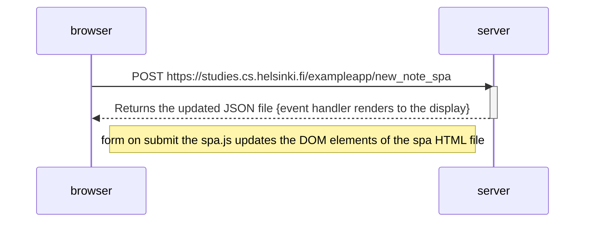

# Sequence Diagram for creating a new note exampleapp single page application

```mermaid
sequenceDiagram
    participant browser
    participant server

    browser->>server: POST https://studies.cs.helsinki.fi/exampleapp/new_note_spa
    activate server
    server-->>browser: Returns the updated JSON file {event handler renders to the display} 
    deactivate server

    Note right of browser: form on submit the spa.js updates the DOM elements of the spa HTML file 


```